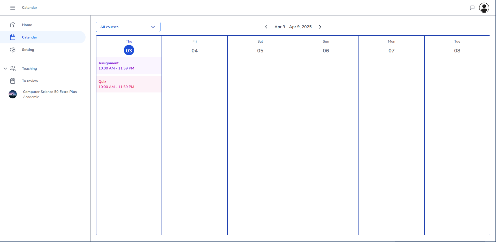
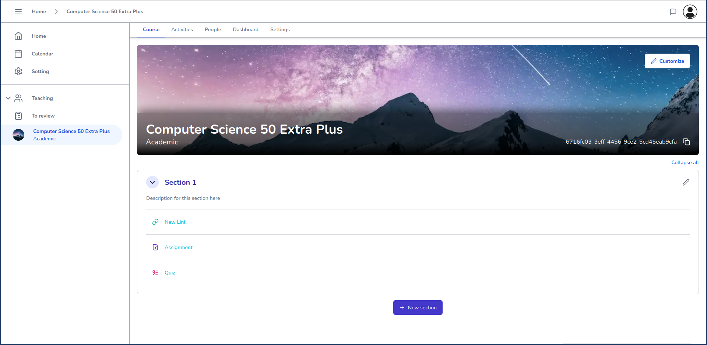
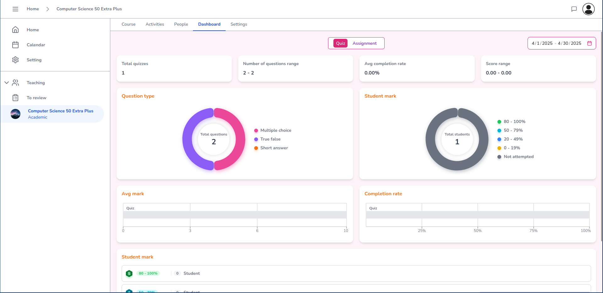

# Let's Learn Project

This repository contains a multi-service application designed to support collaborative learning. It includes a backend, real-time communication server, collaborative drawing server, and a user interface.

## Project Structure

- **Backend**: Implements core business logic and provides APIs for the application. Built with Java and Spring Boot.
- **Livekit Server**: Handles real-time communication and media streaming. Built with Go and LiveKitSDK.
- **Tldraw Server**: Supports collaborative drawing functionality. Built with Node.js and tldraw.
- **UI**: A user-friendly interface for interacting with the application. Built with Next.js.
- **Docs**: Contains visual assets and documentation for the project.

## Features

- **Backend**: Manages topics, quizzes, assignments, and user interactions.
- **Livekit Server**: Enables real-time communication for meetings and collaboration.
- **Tldraw Server**: Provides tools for collaborative drawing and room management.
- **UI**: Displays dashboards for assignments, quizzes, and other learning activities.

### Visual Overview

Here are some screenshots of the application:

#### Calendar View

#### Course Overview

#### Dashboard

#### Quiz in Progress

## Development and Deployment

- **Docker**: The project uses Docker Compose for easy setup and deployment.
- **Technologies**: Java, Go, Node.js, and React/Next.js are the primary technologies used.

## Getting Started

1. Clone the repository.
2. Use `docker-compose up` to start all services.
3. Access the application through the UI at `http://localhost:3000`.